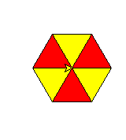

## 基础题

1. 变量

 > 声明一个变量 用来存储年龄， 年龄是 20 岁

 > 声明一个变量 存储一句话 ： 我们早上的太阳

2. 输入 ，输出函数

 > 输入你的班级，并输出（打印）你的班级

 > 输入你的年龄，并打印你的年龄

 > 输入一个长方形形的长和宽，计算出面积和周长， 输出内容要明确（打印格式化）。示例输出 面积是 20，周长是 18

3. 判断

 > 输入一个数字，判断是否超过 18 岁，超过打印：我已成年， 没有超过打印 我还是未成年

 > 游乐场门票，6 岁以下免费，6-59 岁 收费 20 元，60 岁以上 3 元。请输入你的年龄，输出你应该付多少钱

4. 循环

 > 打印从 1 到 1000 之间（包括 1000）之间所有 3 的倍数

 > 打印从 1-1000 之间的所有奇数 使用两种写法。

 > 有一个物体，初始高度是 1023 米，落地（0m）之前，它以每秒 9.8m 的速度下落，请打印它的高度变化

## 综合题

1. 分解数字。输入一个三位数，将分别输出它的百位，十位，个位。示例 输入 321，输出 ：百位是 3 十位是 2 个位是 1

2. 输入一个数字，当它是奇数时，打印从 0-100（包括 100）之间的所有奇数（单数），否则打印 0-100 之间的所有偶数（双数）

> 逢 7 过

3. 逢 7 过游戏（范围从 0-99 包括 99），每当数字中包含 7 或者是 7 的倍数时，都要说（打印）过，否则说出（打印）这个数字

> 逢 7 过游戏（范围从 0-99）进阶 

4. 输入一个数字，范围在 0-99 之间，需要对输入的数字判断，输入错误，打印 请重新输入，否则按照逢 7 过游戏继续玩

## 扩展题（选做）

1. 数字反转。 输入一个三位数，将它反转一下。示例 输入 321，输出 123

2. 实现如下效果
   
3. 实现 99 乘法表 (循环嵌套)
