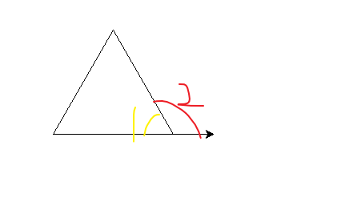
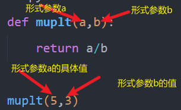
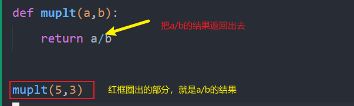

## 变量

> 变量：变化的量。存储的内容可能发生变化。

#### 规则

- 只能由数字，字母，下划线组成
- 不能以数字开头，变量名之间不能使用空格分开
- 不能使用 python 关键字，或者函数

#### 语法

```python

变量名 = 值

age = 16 # 定义一个变量 age ，存储 数字16。从右往左读，将数字16赋值给变量age，= 是赋值的意思
```

## 输入输出函数

> 接受外部输入时需要用到输入函数 `input()` 。一般输入函数和变量结合使用，输入的内容都需要用变量保存，以便后边的使用(input() 函数默认会将输入的内容保存为**字符串**)

> 将内容输出让我们看到 使用输出函数（或者叫打印函数）`print()`

> **input() 括号里边一般填写的是提示信息**

```python
# 输入你的姓名并打印

# 将输入的内容存到变量name中
name =  input('请输入你的姓名：')
print(name)
print('张三')
```

**当输入的内容需要作为数字做运算时，就需要使用 int()或者 float()**

```python
age = int(input('请输入你的年龄'))
if age>18:
    print('我成年了')
elif age>10:
    print('我还在长个子')
else:
    print('我还是小孩子')
```

> int() 将括号里内容装为整数
> float() 将括号里内容装为浮点数

## 数学运算

|      | 加法 | 减法 | 乘法 | 除法 | 求余          | 整除             | 判断相等                                          | 大于 | 小于  | 大于等于 | 小于等于 |
| ---- | ---- | ---- | ---- | ---- | ------------- | ---------------- | ------------------------------------------------- | ---- | ----- | -------- | -------- |
|      | +    | -    | \*   | /    | %             | //               | ==                                                | >    | <     | >=       | <=       |
|      | 2+3  | 3-2  | 3\*2 | 3/2  | 5%2(只要余数) | 5//2(要整除部分) | 5==2(判断两边是否相等，结果为 True，False 中一个) | 3>2  | 3<2   | 4>=4     | 5<=7     |
| 结果 | 5    | 1    | 6    | 1.5  | 1             | 2                | False                                             | True | False | True     | True     |

## 判断

#### 对条件的判断 ，条件的结果只有两种结果，真 True，假 False

> 可以只使用 if，也可以只使用 if else。但是 elif 的使用，前边必须有 if

```python
if 条件：
    条件成立做的事
elif 条件：
    条件成立做的事
else:
    上边条件都不成立做的事
# if 意为如果， else 意为否则， elif 意为否则如果


# 如果年龄大于18岁，打印 我成年了，如果年龄大于10岁，打印 我还在长个子，否则打印 我还是小孩子
age = 18

if age>18:
    print('我成年了')
elif age>10:
    print('我还在长个子')
else:
    print('我还是小孩子')

```

## 循环

#### for 循环（有限次循环）

```python
for 变量 in range(a,b,c):
    循环体内容

# a,b,c 都是数字。 从a开始，到b-1结束，每个数字间差c 。c 默认是1


for i in range(0,11,2):
    print(i)
# 打印结果如下
# 0
# 2
# 4
# 6
# 8
# 10

for i in range(0,3):
    print(i)

for i in range(3):
    print(i)
# 这两种写法等价

# 0
# 1
# 2
```

#### while 循环（无限循环或有限循环）

**有限循环** 当条件成立时（为 True）会执行循环体内容

```python
while 条件：
    条件成立做的事（循环体）

# 一个会不断减小的数字 ，刚开始它的值是10000，当它大于100时就会不断减小10
num = 10000
while num>100:
    num = num - 10
```

**无限循环**上边说过条件成立会执行循环体内容，那我们可以直接将条件结果设为 True，此时变为无限循环

```python
while True:
    print('我是无限循环，我不会停止')
```

## turtle

网站 https://docs.python.org/zh-cn/3/library/turtle.html

```python
# 要使用画图，必须导入turtle ，且导入这一行尽量放在程序开头
from turtle import *

# 画一个边长为100的正方形
# A 方法
forward(100)
left(90)
forward(100)
left(90)
forward(100)
left(90)
forward(100)
#B方法
for i in range(4):
    forward(100)
    left(90)
```

#### 常用函数

| 函数                  | 作用                                                                                                                            |
| --------------------- | ------------------------------------------------------------------------------------------------------------------------------- |
| goto(x,y)             | 前往(x,y)位置                                                                                                                   |
| pendown() pd() down() | 落笔                                                                                                                            |
| penup() up() pu()     | 抬笔                                                                                                                            |
| forward(n) fd(n)      | 前进 n 步                                                                                                                       |
| back(n) bk(n)         | 后退 n 步                                                                                                                       |
| home()                | 回到画布原点                                                                                                                    |
| left(n) lt(n)         | 左转 n 度                                                                                                                       |
| right(n) rt(n)        | 右转 n 度                                                                                                                       |
| setheading(n) seth(n) | 朝向 n 方向 0 向右，90 向上，180 向左，270 向下                                                                                 |
| hideturtle() ht()     | 隐藏画笔                                                                                                                        |
| color(n)              | 设置为 n 的颜色 示例'red' 画笔设为红色                                                                                          |
| fillcolor(n)          | 填充为 n 颜色 示例 'red' 填充为红色                                                                                             |
| begin_fill()          | 开始填充 在画之前                                                                                                               |
| end_fill()            | 结束填充 在画完后                                                                                                               |
| screensize(x，y)      | 设置画布大小 设置为 x 宽，y 高                                                                                                  |
| pensize(n) width(n)   | 设置笔的粗细 示例 pensize(2) 笔的粗细设为 2                                                                                     |
| circle(r,d,s)         | 画园 示例 circle(100), circle(100,180) circle(100,360,5) r 是半径 ，d 是画多少度的园， d=180 就是半圆 s 的步长 默认可以只写半径 |
| speed(n)              | 画笔速度 画笔速度为 n                                                                                                           |


## 列表
**格式**
> 列表名 = [数据,数据,...]
```python
name = ['张三','李四','王五','赵六']
```
**列表操作**

**列表每个数据都有一个索引，从0开始**
> 列表的操作都需指定列表名，因为可能会有多个列表

****
```python
# 取值 拿到李四 这个名字
name[1]

# 向name列表添加 jack这个名字
name.append('jack')

# 删除赵六这个名字
del name[3]

# 删除最后一项
name.pop()
```

## 定义函数
* 为什么使用函数？
> 把一些重复性，有类似结构的代码或者单一功能的代码抽离出来，使用函数简化代码。

* 下边是举例说明
>任务：画出正五边形，正六边形，正八边形
* 多边形内角和公式 （边数-2）*180
* 每个内角 内角和 / 边数
* 平角 180度


```python
# 正五边形
for i in range(5):
    forward(100)
    left(72)

# 正六边形
for i in range(6):
    forward(100)
    left(60)

# 正八边形
for i in range(8):
    forward(100)
    left(45)
```
**观察以上代码**
> 可以看到他们都有类似的结构，只是循环次数和转的角度不一样。此时我们可以使用函数简化代码。
使用时只需**调用**这个函数，并传入边数(n)和转的度数(j)即可
```python
# 一个画多边形的函数，
def draw(n,j):
    for i in range(n):
        forward(100)
        left(j)


# 正五边形
draw(5,72)

# 正六边形
draw(6,60)
# 正八边形
draw(8,45)
```
#### 函数必须要先定义，才能使用。使用需放在定义后边。
**格式**
> def 函数名(参数，参数):
    函数体内容

**注意**
> 函数名的命名规则，和变量名一样
> return 是返回的意思
```python
# 定义一个函数，计算两数之和
def sum(a,b):
    return a+b

# 计算1+2的结果
sum(1,2)
```

```python

def muplt(a,b):
    return a/b

muplt(5,3)

```



```python
def muplt(a,b):
    return a/b

print(muplt(6,3))

# 打印的结果就是2.0，muplt(6,3)可以把这部分当作数字看，因为它是6/3的结果
```